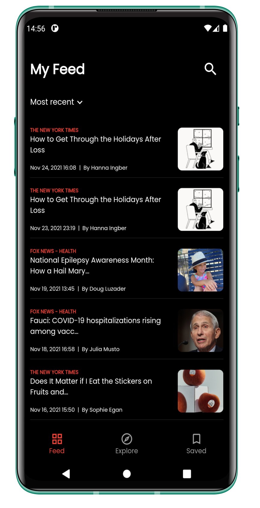
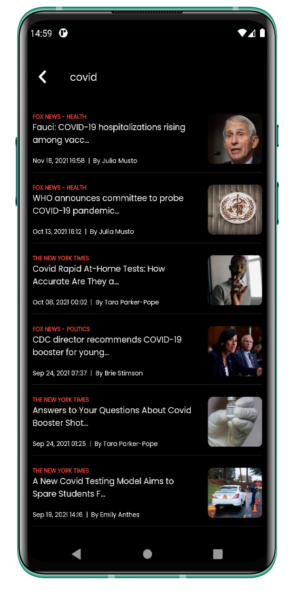
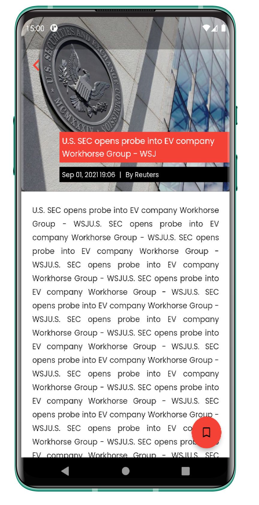
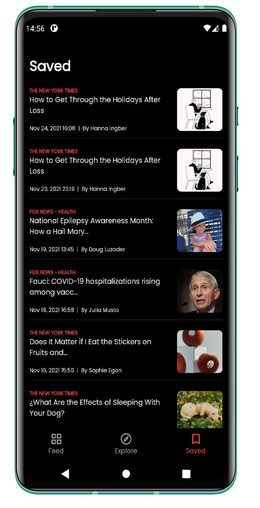
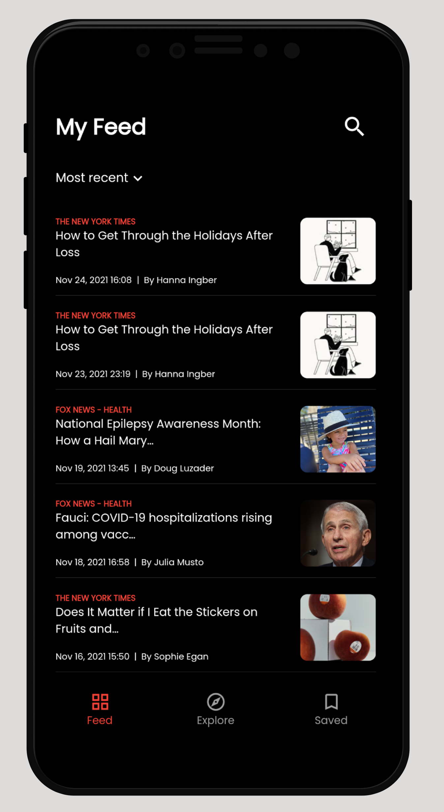

# News app

   

A new Flutter project to view daily news (just for fun).

## Getting Started :rocket:

- Clone the repo
- Install the dependicies
- Run it

## Requirements :computer:

- Any Operating System (MacOS, Linux, Windows)
- Any IDE with Flutter SDK installed (Android Studio, VSCode etc)
- A little knowledge of Dart and Flutter

## Screenshots 📸

|            Feed    |             Research news            |           Read a news         |
|----------------|-------------------------------|-----------------------------|
|||            |

|      Saved news          |  Ios Feed                        |                      |
|----------------|-------------------------------|-----------------------------|
|||            |

                                                                          
###### If you have any features you want to see in this package, feel free to make a suggestion. 🎉

## Don't forget to star ⭐ the repo it motivates me to share more open source.
